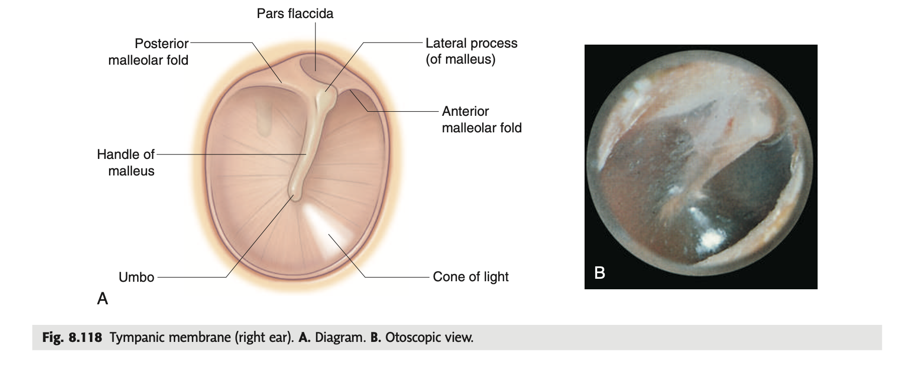

tags:: [[HNNS]], [[Anatomy]], [[Anatomy of the head and neck]] 
status::
alias::

- ### The tympanic membrane and its features
  collapsed:: true
	- The tympanic membrane (or eardrum) is a membranous structure that separates from the external acoustic meatus from the middle ear.
	- It is slanted medially, from top to bottom.
	- **Features of the tympanic membrane**
	  collapsed:: true
		- Inferiorly, the handle of the malleus attaches to the internal surface of the tympanic membrane, forming the **umbo of the tympanic membrane**.
		- Superiorly, the **lateral process of the malleus** protrudes onto the tympanic membrane.
		- Anteroinferior to the umbo, is the **cone of light**.
		- **Superior to the lateral process**, the tympanic membrane is loose (pars flaccida).
		- The rest of the tympanic membrane is thick and taut (pars tensa).
		- 