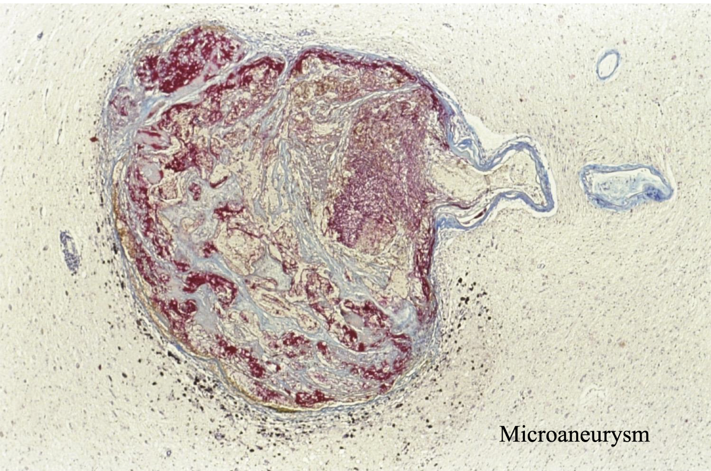

tags:: [[HNNS]], [[pathology]], [[Clinical]] 
status::
alias::

- ### There are various causes of intracerebral haemorrhage, the most common being a complication of hypertension
  collapsed:: true
	- Regarding the risk factors for intracerebral haemorrhage, intracerebral haemorrhage is generally caused by: 1) **Degenerative changes of vessels due to hypertension**, 2) **Aneurysms**, 3) **Repurfusion of infarct**, and 4) **Rupture of tumour**.
	  collapsed:: true
		- **Hypertension is the most common cause of intracerebral haemorrhage**
		  collapsed:: true
			- Hypertension results in high haemodynamic stress in arteries, resulting in the formation of microaneurysms that is not visible to the naked eye.
			- These microaneurysms may rupture, resulting in a hematoma.
			- 
			- Roughly 15% of deaths of individuals with chronic hypertension is a result of hypertensive intracerebral haemorrhage.
		- **Aneurysms**
		  collapsed:: true
			- Saccular (Berry's) aneurysm
			- Mycotic aneurysm
			- Congenital malformations
		- Cerebral infarction caused by ischaemic stroke may develop into a haemorrhagic stroke after repurfusion ([[An infarct caused by an ischaemic stroke can be broadly classified into two groups]]).
		- **Tumours**