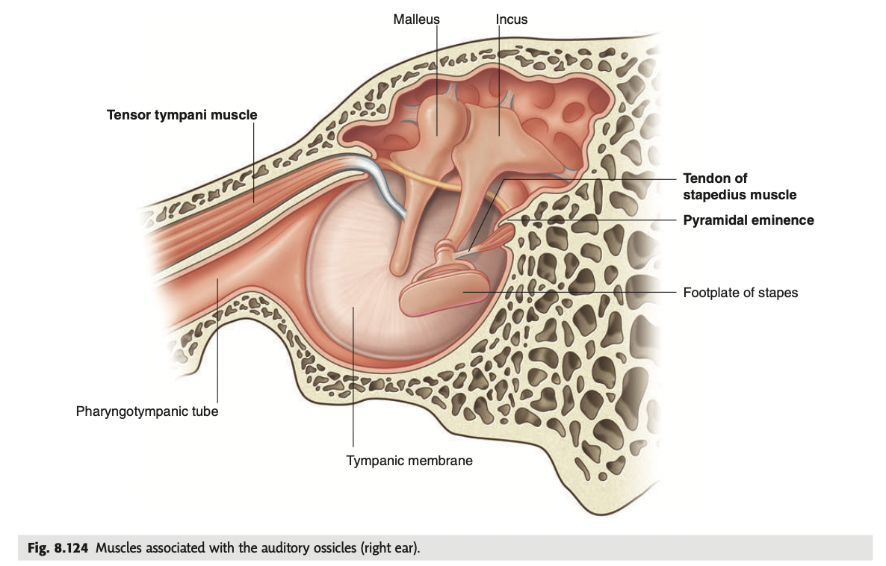

tags:: [[HNNS]], [[Anatomy]], [[Anatomy of the head and neck]]

- ### Two muscles are associated with auditory ossicles for regulation of sound intensity
  collapsed:: true
	- The two muscles are the tensor tympani and the stapedius.
	- **Tensor tympani**
	  collapsed:: true
		- The tensor tympani originates from the cartilagenous part of the auditory tube, the greater wing of the sphenoid bone, and its bone canal, and inserts onto the handle of the malleus.
		- {:height 343, :width 561}
	- **Stapedius**
	  collapsed:: true
		- The stapedius originates from the pyramidal eminence on the posterior (mastoid) wall, and inserts onto the stapes.
	- They function to dampen loud sound.