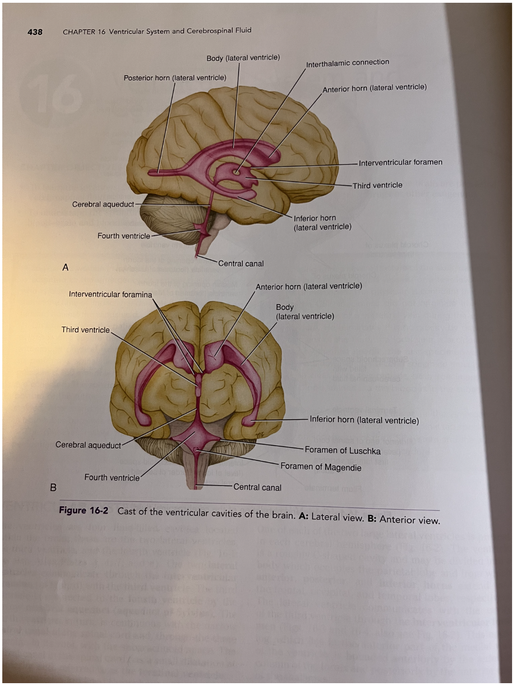
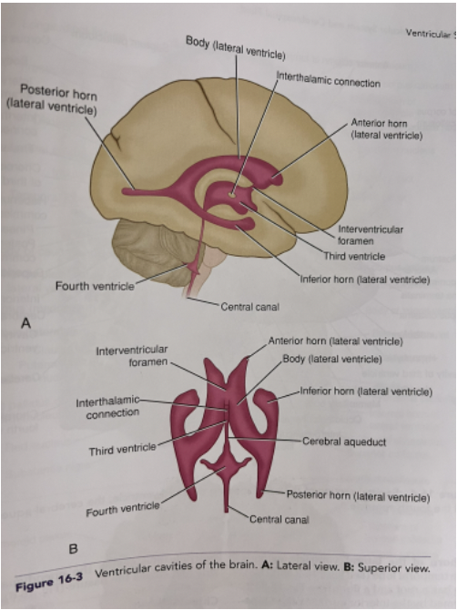

- ### Ventricular system
  collapsed:: true
	- The ventricular system is a *continuous system of 4 cavities within the brain*, derived from the central canal of the neural tube during embryological development.
	- The 4 ventricles are the 2 **lateral ventricles**, the **3rd ventricle**, and the **4th ventricle**.
	- **Common components of the 4 ventricles**
	  collapsed:: true
		- All 4 ventricles consist of [[Choroid plexus]] for the production of [[Cerebrospinal fluid]]. which circulate within the [[Cerebrospinal fluid pathway]].
		- The choroid plexus is lined with **ependyma**, [[IAS38 Neural Architecture#^osot71| made of ependymal cells]].
	- Lateral ventricles
	  id:: 63b38608-09dd-4933-a5c4-d224a8458aa0
	  collapsed:: true
		- The two lateral ventricles are *C-shaped cavities found within the cerebral hemispheres*.
		- The body is found within the **parietal lobe**, with a **frontal horn** that extends into the frontal lobe, a **temporal horn** that extends into the temporal lobe, and an **occipital horn** that extends into the occipital lobe (Cf: [[Lobes of the cerebral hemisphere]]).
		- {:height 763, :width 415}
		- {:height 551, :width 320}
	- 3rd ventricle
	  id:: 63b38608-f9d8-49de-bf4d-b03baa11343b
	  collapsed:: true
		- The 3rd ventricle is a *cleft-shaped cavity found between the two [[Thalamus]]*, i.e. the thalamus (or even the diencephalon) forms the walls of the 3rd ventricle.
		- The two thalamus are connected by the **interthalamic adhesion**, which *subsequently is surrounded by the 3rd ventricle*.
		- It communicates anteriorly with the lateral ventricles via the **interventricular foramina of Monro** and posteriorly with the 4th ventricle via the **cerebral aqueduct**.
	- 4th ventricle
	  id:: 63b38608-57f7-4a30-a0d0-dd8a0dd702ae
	  collapsed:: true
		- The 4th ventricle is a *triangular-shaped cavity* lies between the lower [[Brainstem]], i.e. the [[Medulla]] and lower [[Pons]] and the [[Cerebellum]].
		- It consists of 2 lateral aperture, and 1 median aperture, that drains [[Cerebrospinal fluid]] into the [[Meninges#Arachnoid mater and the subarachnoid space|Subarachnoid space]].
		- It is also continuous with the central canal of the spinal cord.