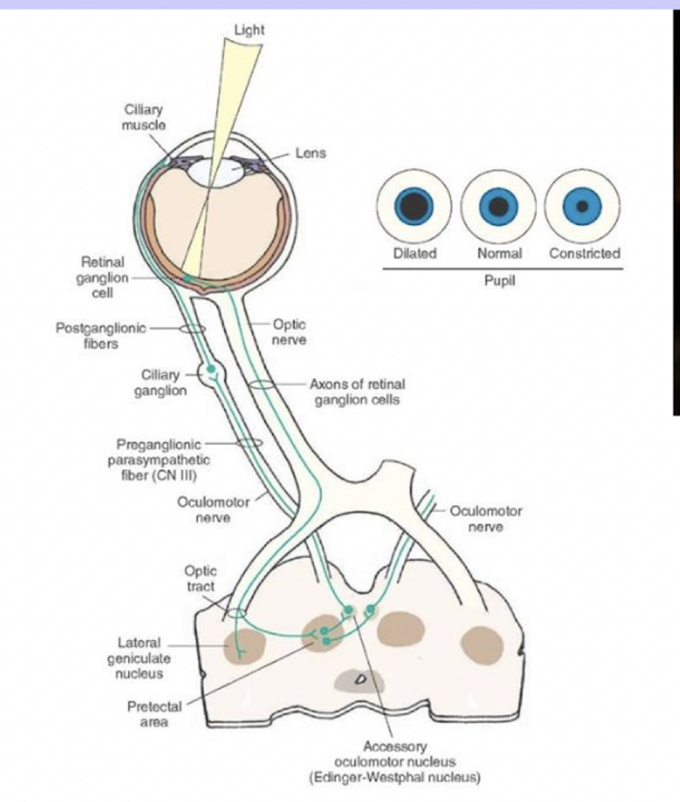

### Pupillary light reflex
	- Pupillary light reflex is an autonomic reflex that detects for lights shone into the eyes, which results in bilateral pupil constriction.
	- **Reflex arc of pupillary light reflex**
	  collapsed:: true
		- When light is shone in the eyes, the retinal ganglion cells are stimulated, which generates action potentials that travel via the [[Optic nerve (CN II)]] towards the pretectal nucleus unilaterally.
		- The pretectal nucleus then stimulates the **Edinger-Westphal nucleus** bilaterally.
		- The Edinger-Westphal nucleus projects **preganglionic parasympathetic fibres** that travel via the [[Occulomotor nerve (CN III)]], stimulating the contraction of **sphincteric pupillae** (circular muscles) of the iris, resulting in direct and consensual pupillary constriction.
		- 
	- **Defects in different parts of pupillary light reflex yields different abnormal signs**
	  collapsed:: true
		- A sensory defect in one eye results in impaired pupil constriction in both eye when it is stimulated.
		- A motor defect in one eye results in impaired pupil constriction in that eye when either eye is stimulated.